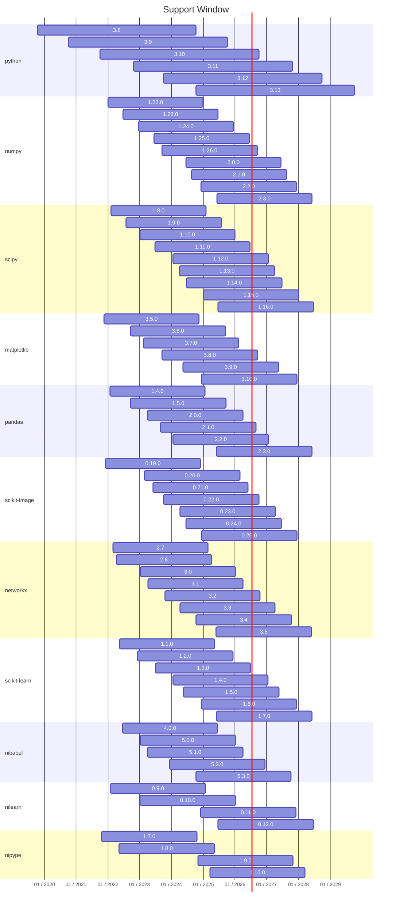

```mermaid
gantt
dateFormat YYYY-MM-DD
axisFormat %m / %Y
title Support Window

section python
3.8 : 2019-10-14,2024-10-12
3.9 : 2020-10-05,2025-10-04
3.10 : 2021-10-04,2026-10-03
3.11 : 2022-10-24,2027-10-23
3.12 : 2023-10-02,2028-09-30
3.13 : 2024-10-07,2029-10-06

section numpy
1.22.0 : 2021-12-31,2024-12-30
1.23.0 : 2022-06-22,2025-06-21
1.24.0 : 2022-12-18,2025-12-17
1.25.0 : 2023-06-17,2026-06-16
1.26.0 : 2023-09-16,2026-09-15
2.0.0 : 2024-06-16,2027-06-16
2.1.0 : 2024-08-18,2027-08-18
2.2.0 : 2024-12-08,2027-12-08
2.3.0 : 2025-06-07,2028-06-06

section scipy
1.8.0 : 2022-02-05,2025-02-04
1.9.0 : 2022-07-29,2025-07-28
1.10.0 : 2023-01-03,2026-01-02
1.11.0 : 2023-06-25,2026-06-24
1.12.0 : 2024-01-20,2027-01-19
1.13.0 : 2024-04-02,2027-04-02
1.14.0 : 2024-06-24,2027-06-24
1.15.0 : 2025-01-03,2028-01-03
1.16.0 : 2025-06-22,2028-06-21

section matplotlib
3.5.0 : 2021-11-16,2024-11-15
3.6.0 : 2022-09-16,2025-09-15
3.7.0 : 2023-02-13,2026-02-12
3.8.0 : 2023-09-15,2026-09-14
3.9.0 : 2024-05-15,2027-05-15
3.10.0 : 2024-12-14,2027-12-14

section pandas
1.4.0 : 2022-01-22,2025-01-21
1.5.0 : 2022-09-19,2025-09-18
2.0.0 : 2023-04-03,2026-04-02
2.1.0 : 2023-08-30,2026-08-29
2.2.0 : 2024-01-20,2027-01-19
2.3.0 : 2025-06-05,2028-06-04

section scikit-image
0.19.0 : 2021-12-03,2024-12-02
0.20.0 : 2023-02-28,2026-02-27
0.21.0 : 2023-06-02,2026-06-01
0.22.0 : 2023-10-03,2026-10-02
0.23.0 : 2024-04-10,2027-04-10
0.24.0 : 2024-06-18,2027-06-18
0.25.0 : 2024-12-13,2027-12-13

section networkx
2.7 : 2022-02-28,2025-02-27
2.8 : 2022-04-09,2025-04-08
3.0 : 2023-01-08,2026-01-07
3.1 : 2023-04-04,2026-04-03
3.2 : 2023-10-19,2026-10-18
3.3 : 2024-04-06,2027-04-06
3.4 : 2024-10-10,2027-10-10
3.5 : 2025-05-29,2028-05-28

section scikit-learn
1.1.0 : 2022-05-12,2025-05-11
1.2.0 : 2022-12-08,2025-12-07
1.3.0 : 2023-06-30,2026-06-29
1.4.0 : 2024-01-18,2027-01-17
1.5.0 : 2024-05-21,2027-05-21
1.6.0 : 2024-12-09,2027-12-09
1.7.0 : 2025-06-05,2028-06-04

section nibabel
4.0.0 : 2022-06-17,2025-06-16
5.0.0 : 2023-01-09,2026-01-08
5.1.0 : 2023-04-03,2026-04-02
5.2.0 : 2023-12-11,2026-12-10
5.3.0 : 2024-10-08,2027-10-08

section nilearn
0.9.0 : 2022-01-28,2025-01-27
0.10.0 : 2023-01-06,2026-01-05
0.11.0 : 2024-12-02,2027-12-02
0.12.0 : 2025-06-21,2028-06-20

section nipype
1.7.0 : 2021-10-20,2024-10-19
1.8.0 : 2022-05-10,2025-05-09
1.9.0 : 2024-10-31,2027-10-31
1.10.0 : 2025-03-19,2028-03-18
```
