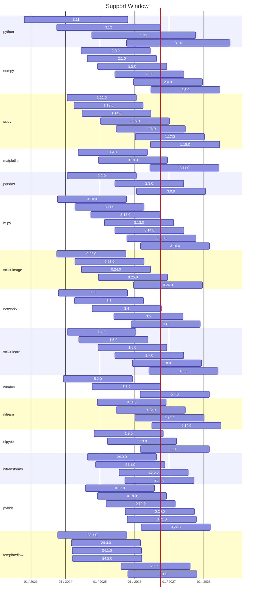

```mermaid
gantt
dateFormat YYYY-MM-DD
axisFormat %m / %Y
title Support Window

section python
3.11 : 2022-10-24,2025-10-23
3.12 : 2023-10-02,2026-10-01
3.13 : 2024-10-07,2027-10-07
3.14 : 2025-10-07,2028-10-06

section numpy
2.0.0 : 2024-06-16,2026-06-16
2.1.0 : 2024-08-18,2026-08-18
2.2.0 : 2024-12-08,2026-12-08
2.3.0 : 2025-06-07,2027-06-07
2.4.0 : 2025-12-20,2027-12-20
2.5.0 : 2026-06-21,2028-06-20

section scipy
1.12.0 : 2024-01-20,2026-01-19
1.13.0 : 2024-04-02,2026-04-02
1.14.0 : 2024-06-24,2026-06-24
1.15.0 : 2025-01-03,2027-01-03
1.16.0 : 2025-06-22,2027-06-22
1.17.0 : 2026-01-10,2028-01-10
1.18.0 : 2026-06-19,2028-06-18

section matplotlib
3.9.0 : 2024-05-15,2026-05-15
3.10.0 : 2024-12-14,2026-12-14
3.11.0 : 2026-06-12,2028-06-11

section pandas
2.2.0 : 2024-01-20,2026-01-19
2.3.0 : 2025-06-05,2027-06-05
3.0.0 : 2026-01-21,2028-01-21

section h5py
3.10.0 : 2023-10-09,2025-10-08
3.11.0 : 2024-04-10,2026-04-10
3.12.0 : 2024-09-25,2026-09-25
3.13.0 : 2025-02-18,2027-02-18
3.14.0 : 2025-06-06,2027-06-06
3.15.0 : 2025-10-13,2027-10-13
3.16.0 : 2026-03-06,2028-03-05

section scikit-image
0.22.0 : 2023-10-03,2025-10-02
0.23.0 : 2024-04-10,2026-04-10
0.24.0 : 2024-06-18,2026-06-18
0.25.0 : 2024-12-13,2026-12-13
0.26.0 : 2025-12-20,2027-12-20

section networkx
3.2 : 2023-10-19,2025-10-18
3.3 : 2024-04-06,2026-04-06
3.4 : 2024-10-10,2026-10-10
3.5 : 2025-05-29,2027-05-29
3.6 : 2025-11-24,2027-11-24

section scikit-learn
1.4.0 : 2024-01-18,2026-01-17
1.5.0 : 2024-05-21,2026-05-21
1.6.0 : 2024-12-09,2026-12-09
1.7.0 : 2025-06-05,2027-06-05
1.8.0 : 2025-12-10,2027-12-10
1.9.0 : 2026-06-02,2028-06-01

section nibabel
5.2.0 : 2023-12-11,2025-12-10
5.3.0 : 2024-10-08,2026-10-08
5.4.0 : 2026-03-02,2028-03-01

section nilearn
0.11.0 : 2024-12-02,2026-12-02
0.12.0 : 2025-06-21,2027-06-21
0.13.0 : 2026-01-05,2028-01-05
0.14.0 : 2026-07-02,2028-07-01

section nipype
1.9.0 : 2024-10-31,2026-10-31
1.10.0 : 2025-03-19,2027-03-19
1.11.0 : 2026-03-02,2028-03-01

section nitransforms
24.0.0 : 2024-08-18,2026-08-18
24.1.0 : 2024-11-17,2026-11-17
25.0.0 : 2025-07-22,2027-07-22
25.1.0 : 2025-09-22,2027-09-22

section pybids
0.17.0 : 2024-07-29,2026-07-29
0.18.0 : 2024-12-04,2026-12-04
0.19.0 : 2025-03-05,2027-03-05
0.20.0 : 2025-09-24,2027-09-24
0.21.0 : 2025-10-16,2027-10-16
0.22.0 : 2026-03-12,2028-03-11

section seaborn

section templateflow
23.1.0 : 2023-10-12,2025-10-11
24.0.0 : 2024-03-04,2026-03-04
24.1.0 : 2024-03-15,2026-03-15
24.2.0 : 2024-03-18,2026-03-18
25.0.0 : 2025-08-12,2027-08-12
25.1.0 : 2025-10-21,2027-10-21
```
